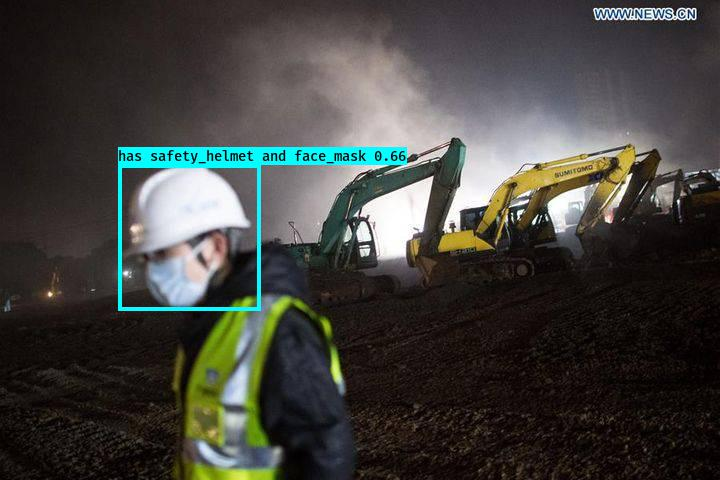
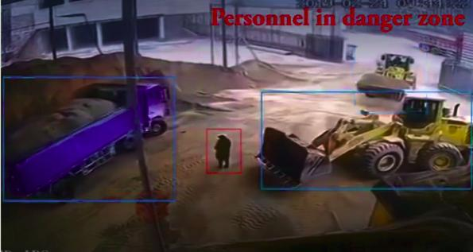

# Construction-Safety-Measure-Detection-Model-with-Evaluation-metric

Building a Custom Construction Safety Detector which will check for presence of safety helmet and coronovirus mask.





1.Repo structure:

+ [`XML_to_CSV.ipynb`]: This script will wxtract annotations for only head portion of an employee from annotations.xml, and will save as CSV file with 4 labels [‘has safety_helmet and face_mask’, ‘face_mask’, ’safety_helmet’, ‘no safety_helmet or face_mask’] for training YOLO deteection model.

+ [`Dataset`]: Train and Test dataset are included with respective GT as csv file.

+ [`Construction_Safety_Measure_Detection_model`]: Scripts and instructions on training and testing your data with YOLO detection model on new images and videos.

+ [`Evaluation_metric.ipynb`]: This script will compare the ground truth and predicted bounding boxes and will be used to evaluate the YOLO object detection model with mean Average Precision (mAP) score. For detailed information on various evaluation metrics, refer https://blog.zenggyu.com/en/post/2018-12-16/an-introduction-to-evaluation-metrics-for-object-detection/


2.Getting Started:
### Requisites
This repo rrequire a running version of python 3.3 or newer. To install the latest python 3.x version go to 
- [python.org/downloads](https://www.python.org/downloads/) 

and follow the installation instructions. 

3.Instructions:

3.1.Data Preparation
To annotate the image data you can use either LabelImg or VOTT. For instructions on image annottions using VOTT, refer [`Construction_Safety_Measure_Detection_model/1_Image_Annotation/Readme.md`]. If you are using LabelImg and created a XML file for image label, you can create a csv file from xml metadata. If you’re using the xml file from this repo, then to convert only head information into csv file, run  

```
python XML_to_CSV.ipynb
```

This will create a Annotations-export.csv file which has to be placed in [`Construction_Safety_Measure_Detection_modelData/Source_Images/Training_Images/VOTT_export`] along with images. While using VOTT, If any file or directory name is modified, make sure the changes are updated in csv and other python scripts for detetion.

3.2.Construction Safety Measure Detection:
+ Create data_train.txt and data_classes.txt which will be used in retraining the YOLO model by running 

```
python “Construction_Safety_Measure_Detection_model/1_Image_Annotation/Convert_to_YOLO_format.py”
```

+ Download and convert the pre-trained YOLOv3 weights by running,
```
python “Construction_Safety_Measure_Detection_model/2_Training/Download_and_Convert_YOLO_weights.py”


python “Construction_Safety_Measure_Detection_model/2_Training/Train_YOLO.py”
```

The final weights are saved in [`Construction_Safety_Measure_Detection_model/Data/Model_weights`]. To list available command line options run `python Train_YOLO.py -h`.

+ To detect and evaluate the performance of our model with multiple images or videos, run the detector script using the command below:
```
python “Construction_Safety_Measure_Detection_model/3_Inference/Detector.py”
```

+ The outputs are saved to [`Construction_Safety_Measure_Detection_model/Data/Source_Images/Test_Image_Detection_Results`]. The outputs include the original images with bounding boxes and confidence scores as well as a file called [`Detection_Results.csv`] containing the image file paths and the bounding box coordinates. For videos, the output files are videos with bounding boxes and confidence scores. To list available command line options run `python Detector.py -h`.

4.Notes:
For  better results can try the following modifications:
+ Increase the amount of training images.
+ Image enhancement before feeding for training or prediction.
 
**To make everything run smoothly it is highly recommended to keep the original folder structure of this repo!**

Each `*.py` script has various command line options that help tweak performance and change things such as input and output directories. All scripts are initialized with good default values that help accomplish all tasks as long as the original folder structure is preserved. To learn more about available command line options of a python script `<script_name.py>` run:

```
python <script_name.py> -h
```
